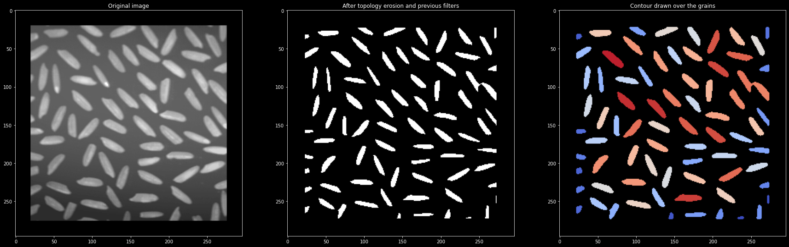

# Counting rice grains in Python

I made this for one of the programming class I teach at HES-SO Valais, for educative purposes only. 

It runs on a Jupyter Notebook and requires `opencv` and `numpy`

Comments welcome, have fun programming!

